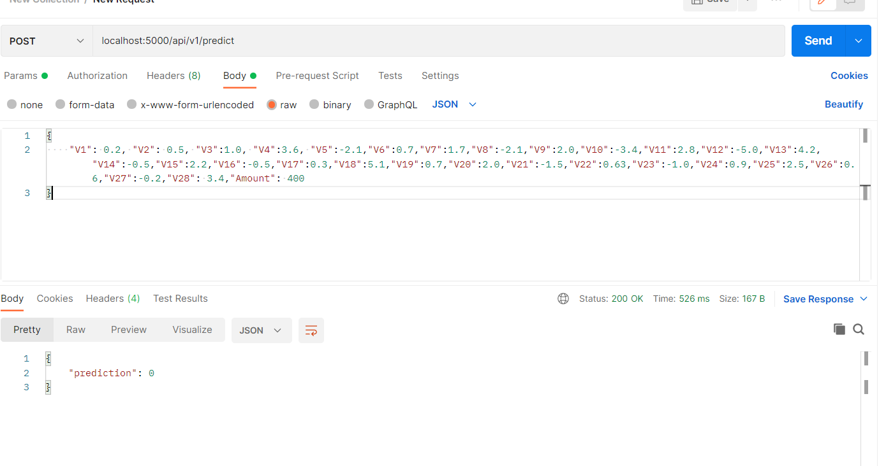

# Credit Card Fraud Detection Classifier #

It is important that credit card companies are able to recognize fraudulent credit card transactions so that customers are not charged for items that they did not purchase.

In this project, I took an open-source dataset from a [Kaggle competition](https://www.kaggle.com/mlg-ulb/creditcardfraud), and trained a binary classifier to predict a frdulent transaction. Then, I served the model inference using REST API, containerized the application and deployed it over Google Cloud, so anybody can make a request to it in real-time. 

## Installation ##

Before running this code, we will need to ensure that Python and the required libraries are installed in the machine. 

```
pip install -r requirements.txt
```

## Model training ##

Before training our own classifier on Kaggle dataset, we will need to ensure that the csv file (downloaded from [Kaggle link]((https://www.kaggle.com/mlg-ulb/creditcardfraud))), is placed inside `dataset` folder.

For training the classifier and saving the model (for deployment), we will need to run a training notebook, named `model_training.ipynb`. 

This will save the trained model and preprocessing modules in the current directory. 

## Model Deployment ##



For serving the model, and running the inference on custom data, I wrapped the model inference in REST API endpoint. In order to build the API, run this script:

```
python model_deployment.py
```

Then, the request can be sent on: `localhost:PORT_NUMBER/api/v1/predict`